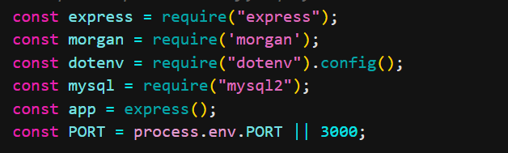
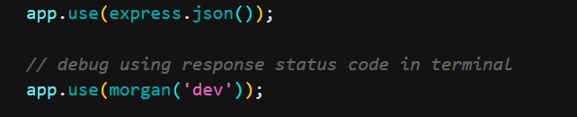
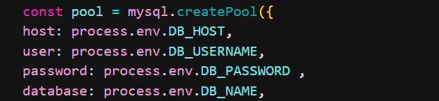
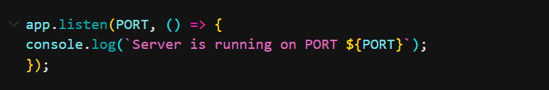

## Code first Girls Assignment 4: APIs

How to run APIs 

- Initialise your Node.js project using `npm init -y` in the terminal. This creates a package.json file. 

- Add `start": "node index.js` to the script to make sure that our node.js can run the APIs we build using `npm start` which starts the server. 

- Install your modules using `npm install express morgan dotenv mysql cors `. This command installs all the aformentioned packages. 

- Next we need to import and install all the tools/dependencies we will need to build and run our APIs. 
- express is for building APIs using js without hard coding everything and allows us to build APIs faster.
- morgan is for logging our response status codes in the terminal and it allows us to debug our APIs via error handling and status codes. 
- dotenv allows to use our credentails that are stored in the env.file.
- msql is for the database connection with sql.

- `app.use` is for asking our app to use the tools we have set up.

- Setting up the pool connection to SQL in this case we are using our env.file to load our credentials to create a connection to sql. Our credentails have to be private for security reasons, so we use process.env.DB_PASSWORD which replaces our real credentails stored in the env.file(in this case our password).

 DB_HOST=localhost
DB_USERNAME=root
DB_PASSWORD=abc123
DB_NAME=AAAA_db
PORT=3000 

- `app.listen` Is a call back function that runs when we start the server and also lets us know that our server is running in the terminal. If you type `npm start` in the terminal it will let you know what PORT you are ruuning on. 

## OUR APIs

Using CRUD build your APIs and 
- Use endpoints for your URL inn postman.
- Use validation to check your database for bad request by error handling using status codes.
- write your SQL quries.
- Error hangle using status codes.
- Open the terminal and kill the terminal using CTRL + C then restart the terminal using `npm start` so the server can run the new code, this will als let you know what PORT your terminal is running on.
- Open postman and send your request by enetering your end point into the URL, if your API has a body write this in the body using json then send your request.
- You can now check your response and you for whatever you queried the DB for, morgan (in the terminal) and postman's body should let you know if have successed using status code and you sould then debug if you have errors. 

Status codes you may come across:
- 200 : request succesful 
- 201 : resource created
- 400 : client side error 
- 500 : Database error

 

